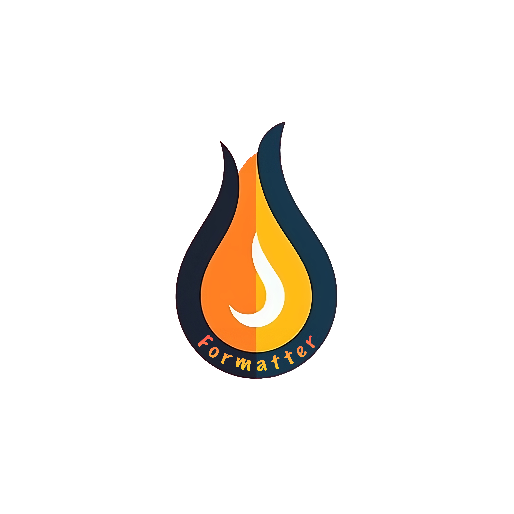

# FormatterJSON

[](https://formatterjson.com)

FormatterJSON is a web-based tool that allows you to convert JSON to various formats such as PHP, TypeScript, and YAML. It also provides features to format and minify JSON.

## Features

- Convert JSON to PHP code
- Convert JSON to TypeScript code
- Convert JSON to YAML code
- Format JSON for readability
- Minify JSON for optimized storage

## Usage

Visit [formatterjson.com](https://formatterjson.com) and follow these steps:

1. Paste your JSON data into the input field.
2. Select the desired output format from the dropdown menu.
3. Click the "Convert" button to convert your JSON data.

You can also use the formatting and minifying options available on the website.

## Examples

### Converting JSON to PHP

```php
<?php
$json = '{"key": "value"}';
$data = json_decode($json, true);

// Output:
// array (
//   'key' => 'value',
// )

```

### Converting JSON to TypeScript
```typescript
const json = '{"key": "value"}';
const data = JSON.parse(json);

// Output:
interface Root {
  key: string
}
```

### Converting JSON to YAML

### Converting JSON to CSV

### Formatting JSON

### Minify JSON

## Contributing

Contributions are welcome! If you find any issues or have suggestions for improvements, please create a GitHub issue or submit a pull request.

Website: [formatterjson.com](formatterjson.com)

